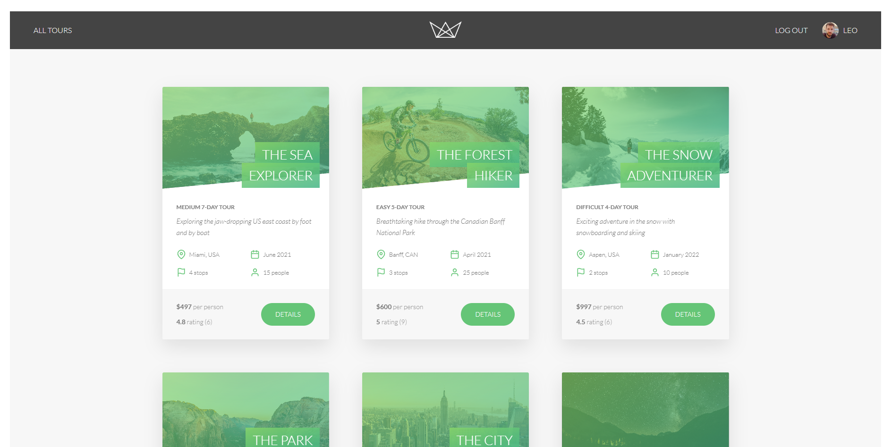

# Natours

Natours is a full-stack tour booking application built with Node.js, Express, MongoDB, and Pug. It combines server-side rendered pages with a JSON API, JWT authentication, Stripe checkout, Mapbox maps, email workflows, file uploads, and several security layers.

This project was built to practice the full request lifecycle in an Express app: from environment setup and database connection, through middleware and controllers, all the way to rendered pages and browser-side interactions.

## Demo And Preview

- Live demo: [https://natours-rabea.vercel.app/](https://natours-rabea.vercel.app/)

- Postman documentation: [https://documenter.getpostman.com/view/52128566/2sBXiqEUFS](https://documenter.getpostman.com/view/52128566/2sBXiqEUFS)



## What This App Shows

- Browse tours on a public overview page and open a single tour page with reviews, images, and a map.
- Sign in with JWT-based authentication stored in secure cookies.
- Update account details and profile photo from the account page.
- Book tours through Stripe Checkout.
- View booking status and user-specific tours after checkout.
- Create, update, and manage tours, users, and reviews through protected routes.
- Send transactional emails for welcome messages and password resets.
- Protect the app with middleware for rate limiting, sanitization, compression, HTTP headers, and parameter pollution defense.

## REST API Features

The app also exposes a RESTful API under `/api/v1`, designed for CRUD operations, authentication, and advanced tour queries.

### Authentication And User Routes

- `POST /api/v1/users/signup` creates a new user account.
- `POST /api/v1/users/login` logs a user in and returns a JWT cookie.
- `GET /api/v1/users/logout` clears the login cookie.
- `POST /api/v1/users/forgot-password` sends a password reset email.
- `PATCH /api/v1/users/reset-password/:token` resets the password using the emailed token.
- `PATCH /api/v1/users/update-password` lets a logged-in user change their password.
- `PATCH /api/v1/users/update-me` updates the current user profile and photo.
- `DELETE /api/v1/users/delete-me` deactivates the current user account.
- `GET /api/v1/users/me` returns the current user's profile data.
- Admin-only routes support full user CRUD with `GET /`, `POST /`, `GET /:id`, `PATCH /:id`, and `DELETE /:id`.

Why this matters: the API supports both normal account workflows and admin-level user management with proper protection and role checks.

### Tour Routes

- `GET /api/v1/tours` returns all tours with filtering, sorting, field limiting, and pagination support.
- `POST /api/v1/tours` creates a new tour for admin and lead-guide users.
- `GET /api/v1/tours/:id` returns one tour by id.
- `PATCH /api/v1/tours/:id` updates a tour and supports image upload and resizing.
- `DELETE /api/v1/tours/:id` deletes a tour.
- `GET /api/v1/tours/top-5-cheap` returns the predefined cheap-tour shortcut.
- `GET /api/v1/tours/tours-stats` returns aggregated tour statistics.
- `GET /api/v1/tours/monthly-plan/:year` returns a monthly planning report for guides and admins.
- `GET /api/v1/tours/tours-within/:distance/center/:latlng/unit/:unit` performs geospatial radius queries.
- `GET /api/v1/tours/distances/:latlng/unit/:unit` calculates tour distances from a point.

Why this matters: these endpoints demonstrate a real-world REST API with query features, aggregation, geospatial search, and role-based write access.

### Review Routes

- `GET /api/v1/tours/:tourId/reviews` lists reviews for a specific tour.
- `POST /api/v1/tours/:tourId/reviews` creates a review for the current tour.
- `GET /api/v1/reviews/:id` returns one review.
- `PATCH /api/v1/reviews/:id` updates a review.
- `DELETE /api/v1/reviews/:id` deletes a review.

Why this matters: reviews are modeled as a nested resource so the API can connect each review to both the tour and the logged-in user.

### Booking Routes

- `GET /api/v1/bookings/checkout-session/:tourId` creates the Stripe checkout session for a tour.
- Admin and lead-guide users can access full booking CRUD with `GET /`, `POST /`, `GET /:id`, `PATCH /:id`, and `DELETE /:id`.

Why this matters: bookings bridge the API, the payment provider, and the user’s authenticated session.

### API Design Notes

- The API follows RESTful naming and controller separation.
- Auth and permissions are enforced with `protect` and `restrictTo` middleware.
- Tour queries include advanced options like filtering, sorting, field limiting, pagination, geospatial search, and aggregation.
- Nested review routes use the tour id to keep the relationship explicit.
- Stripe checkout uses a dedicated endpoint because payment flows need their own request lifecycle.

If you want to document the API formally, paste the Postman collection or workspace link in the placeholder above.

## Main Techniques And Why They Were Used

### Express Application Structure

The app is split into `server.js` and `app.js` so startup concerns stay separate from app configuration.

- `server.js` loads environment variables, connects to MongoDB, starts the HTTP server, and handles process-level failures.
- `app.js` defines middleware, static asset serving, route mounting, 404 handling, and the global error handler.

Why this matters: separating bootstrapping from app composition makes the code easier to test, reuse, and reason about.

### Server-Side Rendering With Pug

Views are rendered with Pug templates from the `views/` folder.

- `base.pug` defines the shared layout.
- `overview.pug`, `tour.pug`, `login.pug`, and `account.pug` render the main user-facing pages.
- Email templates in `views/email/` reuse the same templating idea for transactional email.

Why this matters: server-side rendering makes the app fast to load, keeps page structure centralized, and lets the backend inject real data directly into views.

### MongoDB And Mongoose Modeling

The app uses Mongoose models for tours, users, reviews, and bookings.

- Tour data includes fields, virtuals, geospatial queries, slug generation, and review population.
- User data includes password hashing, password-change timestamps, and reset-token helpers.
- Review data recalculates ratings automatically.

Why this matters: Mongoose gives the project schema validation, reusable model logic, hooks, and query helpers without losing MongoDB flexibility.

### Authentication And Authorization

Authentication is based on JWTs stored in HTTP-only cookies.

- Users log in with email and password.
- Middleware checks cookies or authorization headers and loads the current user.
- Protected routes block unauthenticated access.
- Role-based authorization restricts admin-only and guide-only actions.
- Password reset flow uses secure, time-limited tokens sent by email.

Why this matters: it demonstrates the standard secure authentication pattern used in many production Node apps.

### Security Middleware

The app applies multiple layers of request hardening.

- `helmet` sets security-related HTTP headers.
- `express-rate-limit` protects API routes from abuse.
- `@exortek/express-mongo-sanitize` reduces NoSQL injection risk.
- `hpp` prevents parameter pollution.
- `compression` reduces response size.
- `cors` enables cross-origin access where needed.

Why this matters: security is treated as part of the app architecture, not as an afterthought.

### File Uploads And Image Processing

User and tour images are uploaded with `multer`, then resized and converted with `sharp`.

- Profile photos are cleaned up before being saved.
- Tour images are processed into the sizes the frontend needs.

Why this matters: the app controls image dimensions and formats on the server instead of relying on the browser or client-side scripts.

### Payments With Stripe

Stripe Checkout handles booking payments.

- The server creates checkout sessions.
- The frontend redirects users to Stripe only when they click the booking button.
- Stripe webhooks confirm successful payments and create bookings.

Why this matters: it demonstrates a real payment integration with both client-side and server-side parts.

### Maps And Location Data

Mapbox is used to display tour locations on the tour page.

- Tour pages pass location data to the frontend.
- The client script builds the map only on pages that need it.

Why this matters: it shows how to bridge backend data and interactive browser UI without loading map code everywhere.

### Email Workflows

Nodemailer is wrapped in a small helper class for reusable transactional email rendering and sending.

- Welcome emails are sent after signup.
- Password reset emails include secure reset links.

Why this matters: encapsulating email logic keeps controllers focused on request handling instead of transport details.

### Frontend Build And Client-Side Logic

The client entry point is `public/js/index.js`, and Parcel bundles the browser code.

- DOM guards load functionality only on the pages that need it.
- Stripe is imported lazily when the booking button exists.
- Map rendering, login, logout, and account updates are handled from one browser entry file.

Why this matters: the frontend stays modular, avoids unnecessary page-level loading, and keeps browser behavior tied to the markup that exists on the page.

### Supporting Libraries

The project also relies on a few smaller packages that make the main flows work cleanly.

- `dotenv` loads `config.env` before the app starts so secrets and service keys stay out of source code.
- `morgan` logs requests in development so API and page behavior is easier to inspect.
- `bcryptjs` hashes passwords before they are stored in MongoDB.
- `jsonwebtoken` creates and verifies auth tokens.
- `cookie-parser` reads the JWT cookie on server requests.
- `validator` validates email addresses in the user model.
- `slugify` creates readable tour slugs for URLs.
- `html-to-text` generates plain-text versions of emails.
- `axios` handles browser-side HTTP requests for login, logout, account updates, and checkout-related calls.
- `nodemailer` sends transactional emails through the email transport configured in the environment.

## How The App Works

1. `server.js` loads `.env` values, connects to MongoDB, and starts the server.
2. `app.js` configures middleware, static assets, routes, and error handling.
3. Requests flow into route files, which map URLs to controller functions.
4. Controllers call Mongoose models, Stripe, email helpers, or filesystem/image utilities.
5. Responses are either rendered Pug pages or JSON API payloads.
6. The global error handler converts errors into a consistent response format.

Middleware order matters here. Body parsing, cookie parsing, sanitization, and route mounting all need to happen in the correct sequence so requests have the data they need before controllers run.

The Stripe webhook is handled with raw JSON parsing because Stripe needs the exact request body to validate the signature.

## Project Structure

- `controllers/` contains the request handlers and business logic.
- `models/` contains the Mongoose schemas and model methods.
- `routes/` maps URLs to controllers and middleware.
- `views/` contains the Pug templates.
- `public/` contains static assets and browser-side JavaScript.
- `utils/` contains reusable helpers for errors, email, async wrappers, and API features.
- `dev-data/` contains seed data and development templates.

## Setup

### Requirements

- Node.js
- MongoDB Atlas or another MongoDB instance
- Stripe test keys
- Mapbox access token
- Email provider credentials for transactional emails

### Environment Variables

Create `config.env` with the values the app expects. The important keys are:

- `DATABASE`
- `DATABASE_PASSWORD`
- `JWT_SECRET`
- `JWT_EXPIRES_IN`
- `JWT_COOKIE_EXPIRES_IN`
- `MAPBOX_ACCESS_TOKEN`
- `EMAIL_USERNAME`
- `EMAIL_PASSWORD`
- `STRIPE_SECRET_KEY`
- `STRIPE_PUBLIC_KEY`
- `STRIPE_WEBHOOK_SECRET`
- `STRIPE_WEBHOOK_SECRET_CLI`

### Install

```bash
npm install
```

### Run Locally

```bash
npm run dev
```

### Production And Debug Scripts

- `npm start` starts the server with Node.
- `npm run dev` starts development mode with Nodemon.
- `npm run debug` starts the app with the debugger.
- `npm run parcel` runs the frontend bundle in watch mode.
- `npm run parcel:build` builds the frontend bundle for production.

The `start:prod` and `debug:prod` scripts currently use Windows `SET` syntax, so they are not cross-platform as written.

## Deployment

The app is configured for Vercel in `vercel.json`, which routes all requests to `server.js`.

That setup works because the Node app is the single entry point and Express handles both the rendered pages and the API routes.

## Learning Summary

This project was used to practice:

- Express app architecture
- Middleware ordering and request lifecycle control
- MongoDB modeling with Mongoose
- JWT authentication and protected routes
- Server-rendered pages with Pug
- Stripe checkout and webhook handling
- Mapbox integration
- File upload and image processing
- Secure email workflows
- Basic production hardening for Node applications
